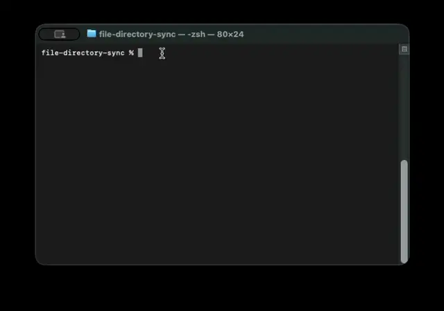

# Verbatim File Directory Sync

**Keep a local folder, file share or document archive continuously in sync with a
[Verbatim AI](https://www.verbatim-ai.com) knowledge base, and chat with your
documents through a secure, GDPR-compliant RAG platform.**

[](https://www.python.org/)
[](https://docs.astral.sh/uv/)
[](https://www.verbatim-ai.com/api-docs/)
[](https://verbatim-ai.openstatus.dev)

`verbatim-sync` is an open-source Python command-line tool for one-way
**document synchronisation** into a Verbatim AI *corpus*. Point it at a
directory tree and it uploads new files, replaces changed ones, removes deleted
ones and resumes interrupted transfers. Run it from **cron** or by hand. Once
your PDFs, Word documents, spreadsheets and other files are in the corpus,
Verbatim AI indexes them for **retrieval-augmented generation (RAG)**, so your
team can ask questions and get answers grounded in your own content.



📖 **[User Guide](USER_GUIDE.md)** covers installation, the configuration
reference, every command option, cron setup, monitoring and troubleshooting.
This README is the short version.

**Contents:** [Features](#features) ·
[About Verbatim AI](#about-verbatim-ai) ·
[The Verbatim AI API](#the-verbatim-ai-api) · [Install](#install) ·
[Configure](#configure) · [Run](#run) · [How it works](#how-it-works) ·
[Related projects](#related-projects)

## Features

- **Incremental sync.** Only new or changed files are sent. Changes are
  detected by SHA-256 content hash, not by modification time alone.
- **Replace in place.** An updated file keeps the same document UID in the
  corpus, so links and references to it stay valid.
- **Resumable uploads.** A local state machine follows the platform's
  init → upload → commit flow, so an interrupted run picks up where it stopped.
- **Safe by default.** `--dry-run` previews every change. A file that only
  falls outside the filters is never deleted.
- **Self-healing state.** The corpus backs up the local SQLite database:
  `--rebuild-db` restores the file-to-document mapping after a loss.
- **Built for unattended jobs.** One TOML config per job, strict validation,
  exit codes cron can act on, rotating logs with credentials redacted, and
  optional JSON log output.
- **Parallel transfers.** A configurable thread pool uploads several files at
  once without changing the result.
- **Filters.** Choose files by include/exclude glob patterns, content type,
  and minimum and maximum size.

Typical uses: feeding a shared drive, NAS or exported document archive into an
AI assistant; keeping a knowledge base current with an internal wiki export;
ingesting scanned reports, contracts, procedures or technical documentation for
semantic search and question answering.

## About Verbatim AI

[Verbatim AI](https://www.verbatim-ai.com) is a French generative-AI platform
that lets businesses **chat with their data**. It is an AI-powered answer engine
that you connect to your files to get precise, sourced answers, with secure,
reliable and customised agents that fit into your processes.

- **RAG answer engine.** Documents are converted, summarised, chunked and
  embedded. Every answer cites the passages it was built from.
- **Many formats.** Multimedia files, OCR for scanned documents, and Markdown
  conversion of the original files.
- **Connectors and integrations.** Mail, Drive, SharePoint and Atlassian
  sources; Microsoft Teams and Slack; an embeddable chatbot widget; and an
  MCP server for AI assistants.
- **Use cases.** Knowledge management, document analysis and synthesis, team
  collaboration and everyday task assistance.

### Our values

- **Your data stays yours.** It is not shared, and it is **never used to train
  AI models**. Privacy is our top priority.
- **Security by design.** A secured RAG architecture with encryption throughout,
  strict per-organisation tenancy, and short-lived scoped credentials.
- **European compliance.** GDPR-compliant and aligned with the EU **AI Act**.
- **A French company** 🇫🇷, a member of French Tech Alps (Grenoble).

👉 [Get started for free](https://app.verbatim-ai.com) ·
[Book a demo](https://meetings-eu1.hubspot.com/veyret) ·
[Documentation](https://verbatim-ai.gitbook.io/docs) ·
[LinkedIn](https://www.linkedin.com/company/verbatim-ai/)

## The Verbatim AI API

Everything this tool does goes through the public Verbatim AI REST API, which
is plain HTTPS and JSON. You can call the same API from your own code.

| Concept | Description |
|---|---|
| **Organization** | The top-level tenant. Each token belongs to exactly one organization, and all data is scoped to it. |
| **Corpus** | A knowledge base that holds documents and sessions. This tool syncs one directory into one corpus. |
| **Document** | A file ingested into a corpus. Ingestion is asynchronous: convert → summarise → chunk → embed. |
| **Session** | A conversation thread over one or more corpora. |
| **Post** | A single question or answer in a session. Answers carry the document chunks used as context. |

The API is organised into domains under `/v1/`: `auth`, `config`, `corpus`,
`doc`, `chunk`, `session`, `post`, `agent` and `usage`. Server-to-server calls
like this tool's authenticate with an **RS512 JWT** signed with your RSA private
key. Browsers and widgets use short-lived, scoped **access tokens**. Verbatim AI
is also a **[Model Context Protocol (MCP)](https://modelcontextprotocol.io)
server**, so assistants such as Claude or Cursor can query your corpora directly.

| Resource | Link |
|---|---|
| API documentation | <https://www.verbatim-ai.com/api-docs/> |
| Swagger playground | <https://www.verbatim-ai.com/api-docs/swagger/> |
| OpenAPI specification (JSON) | <https://www.verbatim-ai.com/api-docs/openapi.json> |
| API status | <https://verbatim-ai.openstatus.dev> |
| Production base URL | `https://api.verbatim-ai.com` |
| Staging base URL | `https://staging-api.verbatim-ai.com` |
| Backoffice | <https://app.verbatim-ai.com> |

## Status

Feature complete for one-way sync: new files are uploaded, changed files are
replaced in place, deleted files are removed from the corpus, and the local
database can be rebuilt from the corpus after a loss.

## Requirements

- Python 3.11+
- [uv](https://docs.astral.sh/uv/)

## Install

```shell
uv sync
```

## Configure

Copy `config.example.toml` ([file here](https://github.com/verbatim-ai/file-directory-sync/blob/main/config.example.toml)) and edit it. Every relative path in the file is
resolved against the file's own directory, so cron's working directory does not
matter.

```shell
cp config.example.toml /etc/verbatim/sync.toml
```

The configuration scopes the run: which tree to walk, the target corpus UID, the
accepted content types and the size bounds, plus where to keep state and logs.

### Credentials

Authentication uses an RS512 JWT signed with your RSA private key
([docs](https://verbatim-ai.gitbook.io/docs/integration/rsa-keys)).

1. Generate a key pair with the platform's `build_keys.py`, from
   [`python-token-builder`](https://github.com/verbatim-ai/python-token-builder):

   ```shell
   python build_keys.py --gen-keys --key-id $(uuidgen | tr 'A-Z' 'a-z') \
       --keys-dir /etc/verbatim/keys
   ```

   This writes `keys/<uuid>` (private, mode `600`) and `keys/<uuid>.pub`.

2. Paste the `.pub` contents into https://app.verbatim-ai.com > Keys.

3. Point the config at it:

   ```toml
   [api]
   organization_id = "<your organisation uuid>"
   keys_dir = "/etc/verbatim/keys"
   key_filename = "<name of the private key file>"
   key_id = "<key uuid issued by the platform>"
   ```

`key_filename` and `key_id` are independent. `build_keys.py` happens to name
the private key after the key's UUID, but that is only its convention — a
keystore built by hand is free to call the file `staging` or `prod.pem`. What
goes into the JWT `kid` header is always `key_id`, which the server uses to
find the public key to verify against; it must be a UUID, and a bad one is
rejected at config load rather than surfacing as an opaque `403`.

The public half is looked for beside the private key, as either `<name>.pub` or
`<stem>.pub`, so `prod.pem` finds `prod.pub`.

The minted token matches the reference implementation exactly:

```json
{ "alg": "RS512", "typ": "JWT", "kid": "<key uuid>" }
{ "iss": "verbatim-ai.com", "iat": ..., "exp": ..., "oid": "<org uuid>" }
```

> The Java client in `../java/verbatim-java-client-auth` issues
> `iss=verbatim_client` and carries the organisation in `sub`. The integration
> docs and the reference `build_keys.py` both use `iss=verbatim-ai.com` and
> `oid`, which is what this project sends.

⚠️ The private key is a credential. Keep it outside the repository, mode `0600`,
and never commit it — the job warns if it is readable beyond its owner.
`.gitignore` covers `keys/`, `key.json` and `*.pem` as a backstop.

## Run

```shell
# Create or migrate the local state database, then exit.
uv run verbatim-sync --config /etc/verbatim/sync.toml --init-db

# Validate the config, sign a token, verify it against the local .pub, then
# probe the API (whoami + accepted content types). Warns if
# filters.content_types lists a type the platform will not ingest.
uv run verbatim-sync --config /etc/verbatim/sync.toml --check

# Report what the sync would change, without sending anything.
uv run verbatim-sync --config /etc/verbatim/sync.toml --dry-run

# Full synchronisation.
uv run verbatim-sync --config /etc/verbatim/sync.toml

# Rebuild the local database from the corpus after losing it.
uv run verbatim-sync --config /etc/verbatim/sync.toml --rebuild-db

# Walk, filter, hash and record state without contacting the corpus.
uv run verbatim-sync --config /etc/verbatim/sync.toml --scan-only

# Report on the local database: files synced, volume, pending, excluded, recent runs.
uv run verbatim-sync --config /etc/verbatim/sync.toml --stats
```

Also available: `--verbose/-v` and `--log-file PATH`.

Exit codes: `0` success, `1` runtime failure (including any file that failed to
sync), `2` configuration error.

### From cron

```cron
17 * * * * /usr/local/bin/uv run --project /opt/file-directory-sync \
    verbatim-sync --config /etc/verbatim/sync.toml
```

## How it works

Uploading a document to the platform is a three-step flow:

1. `POST /v1/doc/init` — declares filename and content type, returns the
   document in `AWAITING_UPLOAD` plus a single-use presigned PUT URL (~900 s).
2. `PUT <uploadUrl>` — the bytes go straight to storage. The `Content-Type`
   header must match what was declared at init.
3. `POST /v1/doc/{id}/commit` — queues ingestion. The server enforces the size
   limit, the accepted content types, and rejects content that already exists
   in the corpus (duplicate detection by content hash).

Then poll `GET /v1/doc/{id}/status` until `READY` or `FAILED`. Replacing the
content of an existing document uses `PUT /v1/doc/{id}/init` instead of step 1,
keeping the same document UID.

### What the sync decides

Each run plans before it acts. Per file:

| Situation | Action |
|---|---|
| Not in the local database | `UPLOAD` — init, PUT, commit |
| Content differs from what the corpus holds | `REPLACE` — re-init the same document id, PUT, commit |
| Gone from disk | `DELETE` — remove the document, then the row |
| Left mid-transfer by an earlier run | `RESUME` — continue from wherever it stopped |
| Corpus already holds this content | `NOOP` |

Change detection is local. `(size, mtime_ns)` is the cheap first check that
decides whether to hash at all; the authoritative comparison is a streaming
SHA-256 against `synced_hash`, the digest of what the corpus actually holds.

> This is deliberately stricter than "mtime newer than the last sync". Comparing
> mtimes alone re-uploads a file that was merely touched, and *misses* one
> restored from a backup with an older timestamp. Hashing catches both. A file
> whose size and mtime are unchanged is never re-read, so the common case costs
> the same either way.

A file still on disk that no longer passes the filters is **not** deleted — it
is reported and left alone. Lowering `max_file_size` should not silently
destroy documents.

### Recovering the local database

Every uploaded document carries its full local path in the `sync_fullpath`
metadata key. If the SQLite file is lost or corrupted, `--rebuild-db` reads it
back:

```shell
uv run verbatim-sync --config /etc/verbatim/sync.toml --rebuild-db
```

Documents whose local file is present and the same size are restored as synced.
Where the sizes disagree the document id is restored but the synced hash is
not, so the next run updates the file rather than assuming the two agree.
Documents with no `sync_fullpath`, or pointing outside the tree, or with no
local file, are reported and left untouched — rebuild reads, it never prunes.

### Concurrency

`sync.threads` (default `5`) sets how many files are processed at once. Each
worker takes one file through the whole init → upload → commit → poll flow,
which is almost entirely network wait, so this is where the wall time goes.

Concurrency changes only the speed, never the result: the plan is computed
before any worker starts, each action concerns exactly one file, and the shared
pieces — the SQLite connection, the token cache and the HTTP client — are each
thread-safe. `threads = 1` skips the pool altogether.

### Timeouts

`api.timeout_ms` (default `5000`) applies to the JSON API calls. Pushing file
bytes to storage takes a separate, longer timeout passed by the caller, since a
50 MB upload cannot share a budget sized for a control-plane request.

> Measured against production: `GET /v1/auth/whoami` has taken well over 5 s to
> respond, exhausting the retry budget at the default. If `--check` shows
> repeated `timed out` warnings, raise `api.timeout_ms`.

> **Note:** `clients/python/verbatim-python-client` is generated against an
> older API version (host `api.verbatim.cloud`, a `POST /v1/doc/{corpusId}`
> upload returning a Google resumable session URL) and does not match
> production. This project talks to the live API directly instead — see
> `src/verbatim_sync/api/`.

## Layout

```
src/verbatim_sync/
├── cli.py            entry point and run modes
├── config.py         TOML -> validated frozen dataclasses
├── logging_setup.py  run-correlated, rotating, credential-redacting logging
├── errors.py
├── db/               schema.sql, migrations, typed repository
├── api/              JWT auth, HTTP client, document endpoints
├── scan/             tree walker, content-type and size filters, hashing
└── sync/             planner (read-only diff) and engine (applies it)
```

`planner.plan()` writes nothing — it walks, filters, hashes and compares. That
is what makes `--dry-run` trustworthy: it runs exactly the code a real sync
runs, then stops.

### Database

`sync_run` records one row per invocation (mode, counters, status), `file` is
the local-file-to-document-UID mapping, and `event` is an append-only audit
trail that survives log rotation. The schema version lives in
`PRAGMA user_version`; migrations are idempotent and applied automatically.

`file` carries two digests. `content_hash` is what is on disk, refreshed on
every scan. `synced_hash` is what the corpus holds, advanced only once a commit
succeeds — so if ingestion later fails, the next run knows to try again.

```shell
sqlite3 state/sync.db "SELECT rel_path, sync_state, document_id FROM file;"
sqlite3 state/sync.db "SELECT id, mode, status, files_scanned FROM sync_run;"
```

### Logging

Every event is logged. Each line carries the `run_id` so overlapping cron runs
stay separable, the file handler rotates, and a redaction filter strips presigned
URL signatures, signed JWTs and PEM private keys before they can reach a
handler. Set `logging.format = "json"` for one structured object per line.

## Test

```shell
uv run pytest
```

with test coverage
```shell
uv run pytest --cov
```

No test touches the network. The HTTP layer is exercised through
`httpx.MockTransport`, which asserts the exact wire shape of every request
against the OpenAPI spec, and the sync engine runs against an in-memory backend
that models the real contract — bytes must be PUT before commit, duplicate
content is rejected, and re-init only works from `READY` or `FAILED`.

## Related projects

Every tool and SDK published for Verbatim AI integrators lives in the
[Verbatim AI GitHub organization](https://github.com/verbatim-ai?tab=repositories):

| Repository | Language | What it is |
|---|---|---|
| [`python-client`](https://github.com/verbatim-ai/python-client) | Python | Generated SDK for the REST API |
| [`typescript-node-client`](https://github.com/verbatim-ai/typescript-node-client) | TypeScript | Generated SDK for the REST API |
| [`java-spring-rest-client`](https://github.com/verbatim-ai/java-spring-rest-client) | Java | Generated SDK (Spring `RestTemplate`) |
| [`java-resteasy-client`](https://github.com/verbatim-ai/java-resteasy-client) | Java | Generated SDK (JAX-RS / RESTEasy) |
| [`python-token-builder`](https://github.com/verbatim-ai/python-token-builder) | Python | Generate RSA key pairs and mint JWTs |
| [`client-demo`](https://github.com/verbatim-ai/client-demo) | Mixed | End-to-end REST client examples |

## Changelog

See [CHANGELOG.md](CHANGELOG.md).

## Support

Questions, bugs or feature requests: open an
[issue](https://github.com/verbatim-ai/file-directory-sync/issues) or
[contact Verbatim AI](https://www.verbatim-ai.com/contact).
